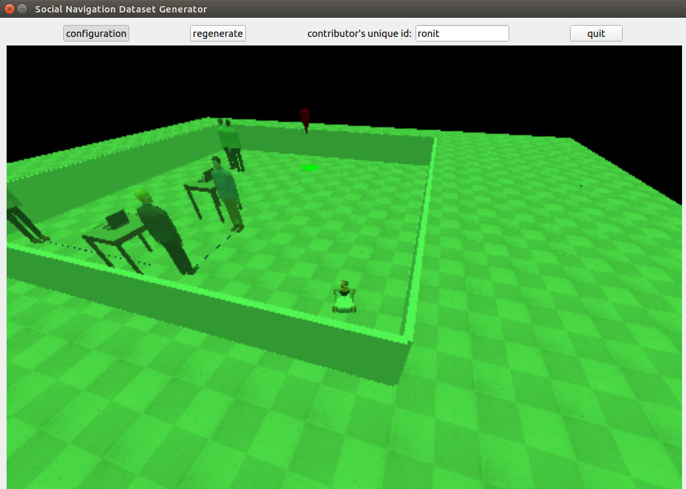
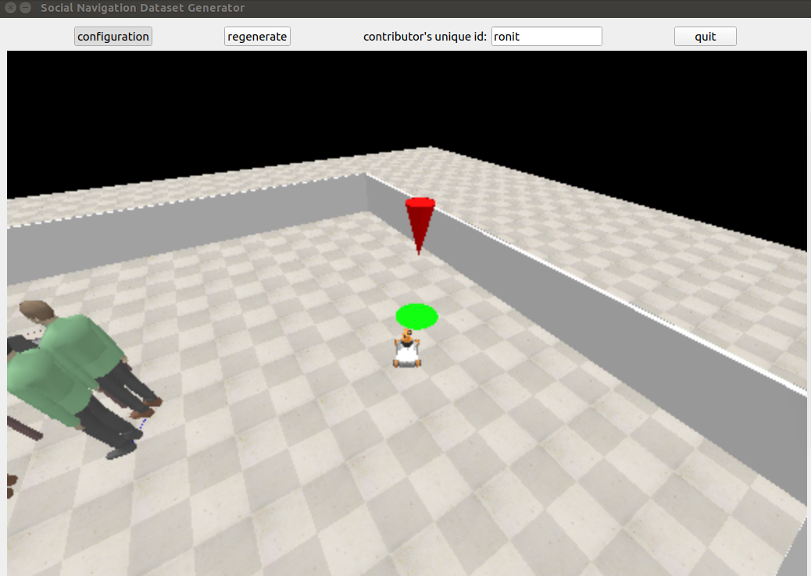

# SONATA

SONATA: A Toolkit to Generate Social Navigation Datasets and HRI

## Introduction

The toolkit is used to generate the dataset by simulating the scenarios for robot's navigation in a social setting. We show an usecase of this data collected from the toolkit by converting into graphs and feeding it into the GNNs to predicts the robot's path in a given scene. The data collected from the toolkit comprises of the following for a given entity:
* Co-ordinates
* Velocity with respect to the robot
* Type of interaction betweeen the two entities
* Orientation
* Size

The data is stored in the form of JSON files, with the following structure:
```
"timestamp": 1598462029.7540903,
        "walls": [
            {
                "x1": 5.64804220199585,
                "x2": 4.9704155921936035,
                "y1": 4.951876163482666,
                "y2": -1.009736180305481
            },
            {
                "x1": 4.970417499542236,
                "x2": -0.991195559501648,
                "y1": -1.0097349882125854,
                "y2": -0.3321133852005005
            },
            {
                "x1": -0.991193413734436,
                "x2": -0.3135751187801361,
                "y1": -0.332114040851593,
                "y2": 5.629499435424805
            },
            {
                "x1": -0.3135727047920227,
                "x2": 5.648040294647217,
                "y1": 5.629498481750488,
                "y2": 4.951875686645508
            }
        ]
    },
    {
        "command": [
            -0.06999999843537807,
            0,
            0.25999999046325684
        ],
        "goal": [
            {
                "x": 0.9240278005599976,
                "y": 3.107682704925537
            }
        ],
        "interaction": [
            {
                "dst": 2,
                "relation": "human_laptop_interaction",
                "src": 1
            }
        ],
        "objects": [
            {
                "a": 0.11155806481838226,
                "id": 2,
                "size_x": 0.8999996185302734,
                "size_y": 0.800000011920929,
                "va": 0.0016205161809921265,
                "vx": 0.006066322326660156,
                "vy": -0.005913734436035156,
                "x": 3.3170711994171143,
                "y": 3.743642807006836
            }
        ],
        "people": [
            {
                "a": -1.458441972732544,
                "id": 1,
                "va": 0.0016202926635742188,
                "vx": -1.5497207641601562e-05,
                "vy": -0.005223274230957031,
                "x": 2.8968095779418945,
                "y": -0.007299661636352539
            }
        ]
```

## Software requirements
1. PyTorch [https://pytorch.org/get-started/locally/](https://pytorch.org/get-started/locally/)
2. DGL [https://www.dgl.ai/pages/start.html](https://www.dgl.ai/pages/start.html)
3. PyTorch Geometric [https://pytorch-geometric.readthedocs.io/en/latest/notes/installation.html](https://pytorch-geometric.readthedocs.io/en/latest/notes/installation.html)
4. CoppeliaSim [https://www.coppeliarobotics.com/](https://github.com/stepjam/PyRep)

# Running the repo

After cloning the directory, execute the following commands:
1. Shift the interfaces to proper location.
    ```
    cp interfaces/* /opt/robocomp/interfaces
    cp interfaces/* /opt/robocomp/interfaces/IDSLs
    ```
2. Run the tool.
    ```
    bash run.sh
    ```

# Usage

After you run the above commands the SONATA GUI opens up.

1. Write the contributor's(user's) name so that the data saved can be marked by the users name.


2. After this the simulation will start with a green tint, and until the mouse controller is clicked robot will not move. 



3. Select the configuration from the top bar of the SONATA GUI to select the range of different entities you want to add in the scene.


4. click on the mouse controller and hold the left key and drag the mouse to move the robot in that direction.


5. Move the robot to the goal marked by the cone.



6. Save your data.


